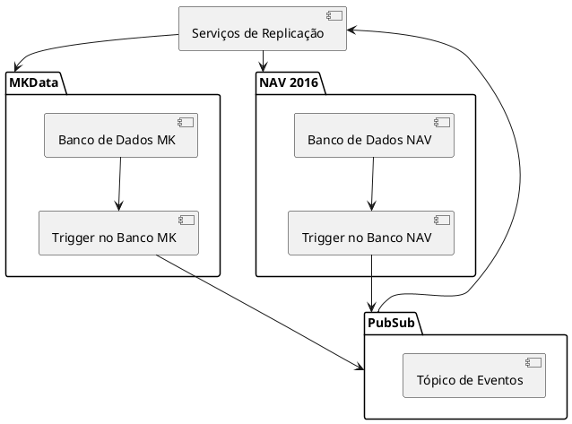
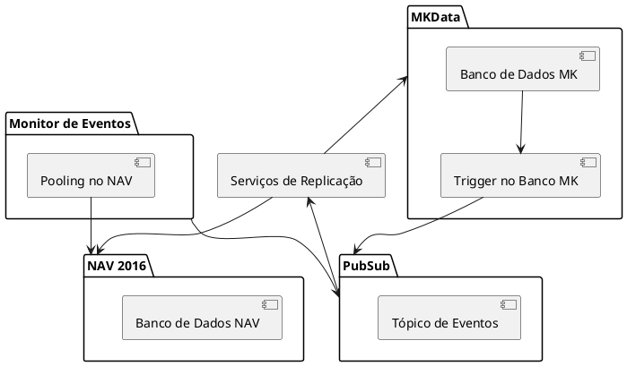
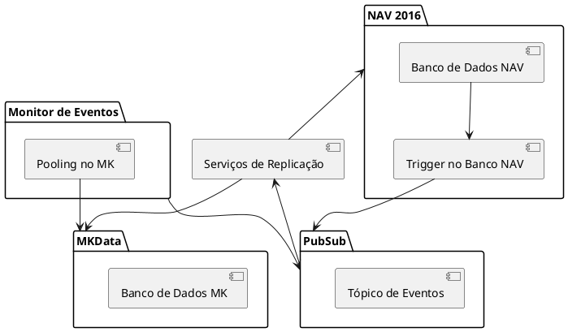
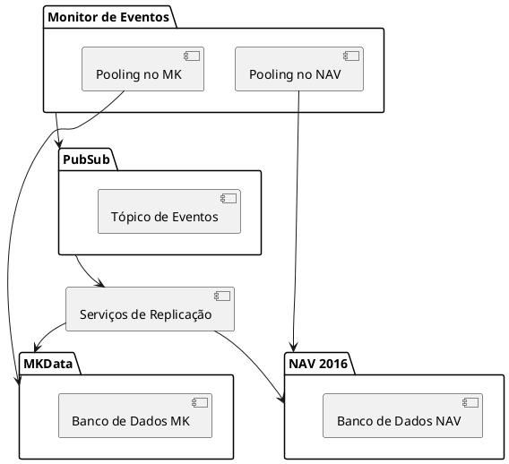
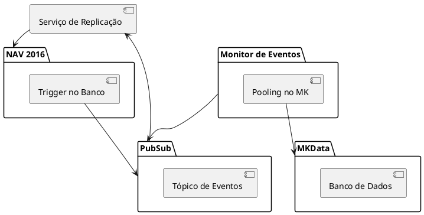
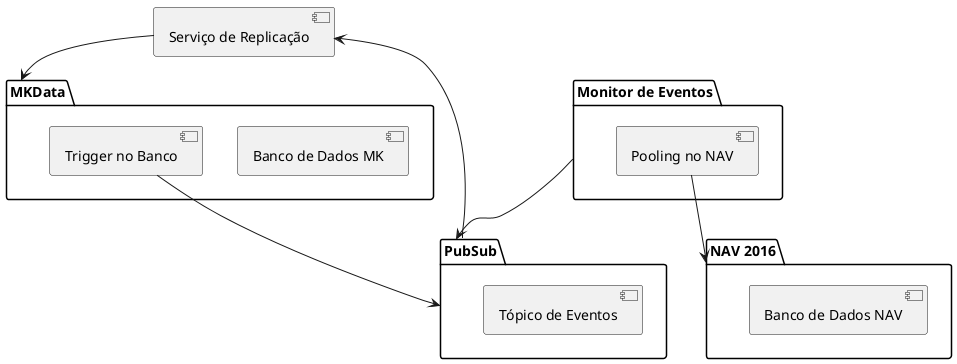

## Cenários de Arquitetura

### Cenário 1: Ambos os lados têm triggers nos bancos de dados

#### Diagrama de Infraestrutura

#### Descrição do Cenário

Neste cenário, tanto o MKData quanto o NAV 2016 possuem triggers nos seus respectivos bancos de dados. Estes triggers são configurados para capturar alterações nos dados. Quando ocorre uma alteração no MKData, o trigger no Banco MK publica um evento no PubSub ([Tópico de Eventos]). Da mesma forma, quando ocorre uma alteração no NAV 2016, o trigger no Banco NAV também publica um evento no mesmo PubSub.

Os Serviços de Replicação estão inscritos neste PubSub para receber e processar os eventos de alteração dos dois sistemas (MKData e NAV 2016), garantindo assim a sincronização bilateral entre eles.

---

### Cenário 2: Apenas MKData possui trigger no banco

#### Diagrama de Infraestrutura

#### Descrição do Cenário

Neste cenário ajustado, apenas o MKData possui um trigger no banco de dados para capturar alterações, que são publicadas diretamente no PubSub ([Tópico de Eventos]). O NAV 2016 não possui trigger no banco de dados.

Um serviço de Monitor de Eventos realiza pooling nos dados do NAV 2016 para detectar alterações. Quando uma alteração é detectada, o Monitor de Eventos lança um evento para o PubSub, que então é consumido pelos Serviços de Replicação.

Os Serviços de Replicação estão inscritos no PubSub para receber e processar eventos de alteração, garantindo a sincronização entre MKData e NAV 2016.

---

### Cenário 3: Apenas NAV 2016 possui trigger no banco

#### Diagrama de Infraestrutura

#### Descrição do Cenário

Neste cenário ajustado, apenas o NAV 2016 possui um trigger no banco de dados para capturar alterações, que são publicadas diretamente no PubSub ([Tópico de Eventos]). O MKData não possui trigger no banco de dados.

Um serviço de Monitor de Eventos realiza pooling nos dados do MKData para detectar alterações. Quando uma alteração é detectada, o Monitor de Eventos lança um evento para o PubSub, que então é consumido pelos Serviços de Replicação.

Os Serviços de Replicação estão inscritos no PubSub para receber e processar eventos de alteração, garantindo a sincronização entre MKData e NAV 2016.

---

### Cenário 4: Nenhum dos lados possui trigger no banco

#### Diagrama de Infraestrutura

#### Descrição do Cenário

Neste cenário corrigido, nenhum dos sistemas (MKData ou NAV 2016) possui triggers no banco de dados para capturar alterações automaticamente.

Ambos os sistemas utilizam serviços de Monitor de Eventos que realizam pooling nos dados dos respectivos bancos de dados (MKData e NAV 2016) para detectar alterações. Quando uma alteração é detectada, o Monitor de Eventos lança um evento para o PubSub ([Tópico de Eventos]).

Os Serviços de Replicação estão inscritos no PubSub para receber e processar eventos de alteração, garantindo a sincronização entre os dois sistemas.

---

### Cenário 5: NAV 2016 sem alteração direta por usuário

#### Diagrama de Infraestrutura

#### Descrição do Cenário

Neste cenário, o MKData não possui triggers no banco de dados, pois as alterações são controladas diretamente por usuários ou processos internos que não envolvem triggers. O NAV 2016 possui um trigger no banco de dados que captura alterações e publica eventos no PubSub ([Tópico de Eventos]).

Um serviço de Monitor de Eventos realiza pooling nos dados do MKData para detectar alterações. Quando uma alteração é detectada, o Monitor de Eventos lança um evento para o PubSub.

Os Serviços de Replicação estão inscritos no PubSub para receber e processar eventos de alteração, garantindo a sincronização entre MKData e NAV 2016.

---

### Cenário 6: MKData sem alteração direta por usuário

#### Diagrama de Infraestrutura

#### Descrição do Cenário

Neste cenário, o MKData possui um trigger no banco de dados que captura alterações e publica eventos no PubSub ([Tópico de Eventos]). Alterações nos dados do MKData são sempre refletidas no PubSub através dos eventos disparados pelo trigger.

O NAV 2016 não possui triggers no banco de dados, mas um serviço de Monitor de Eventos realiza pooling nos dados do NAV 2016 para detectar alterações. Quando uma alteração é detectada, o Monitor de Eventos lança um evento para o PubSub.

Os Serviços de Replicação estão inscritos no PubSub para receber e processar eventos de alteração, garantindo a sincronização de dados entre MKData e NAV 2016.

---

Esses são os cenários modelados com os ajustes solicitados. Cada cenário representa uma configuração diferente para a replicação de dados entre MK e NAV.