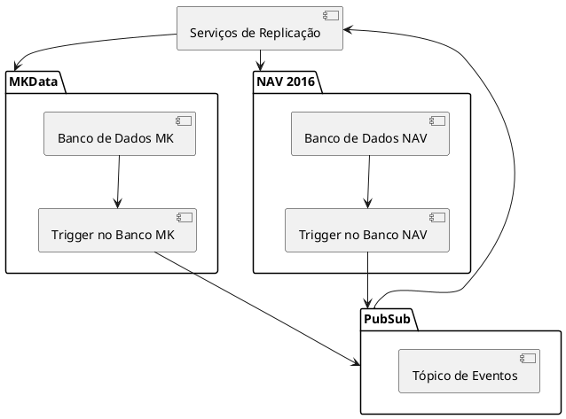
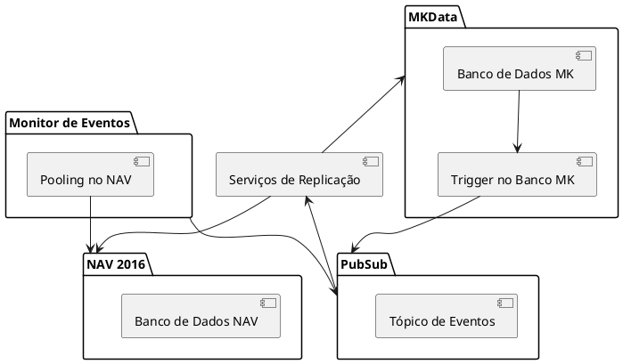
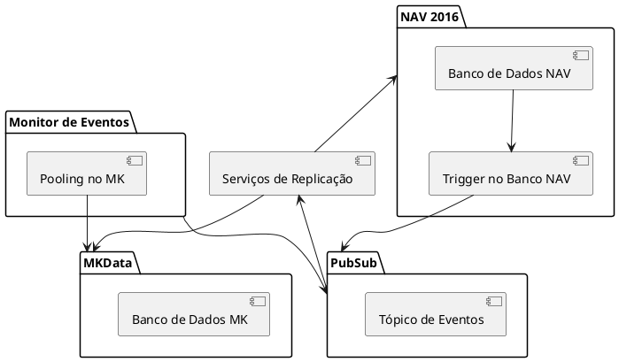
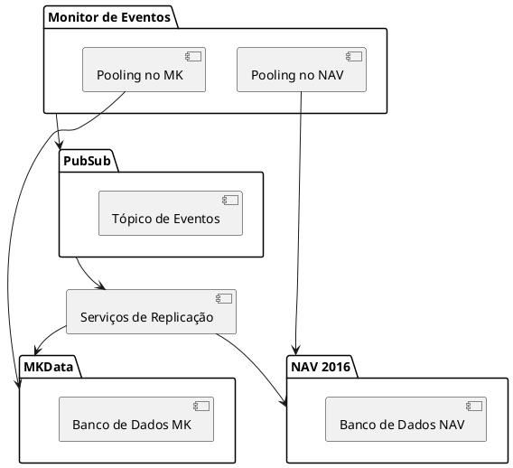
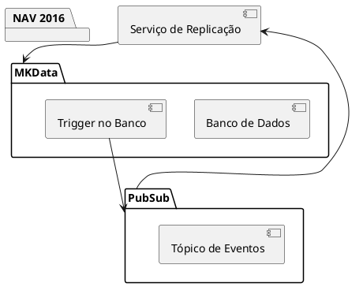
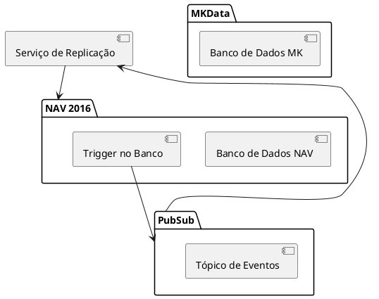
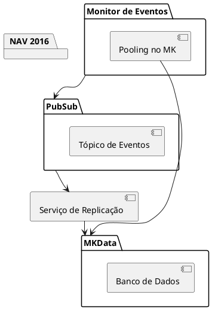
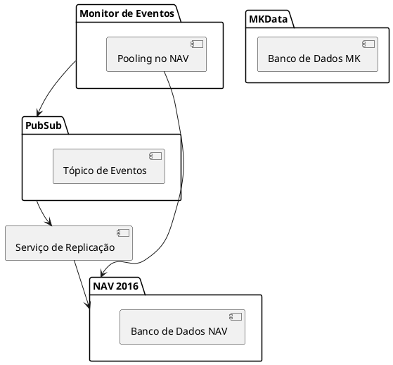

## Cenários de Arquitetura

### Cenário 1: Ambos os lados têm triggers nos bancos de dados e a replicação é bilateral

#### Diagrama de Infraestrutura

### Cenário 2: Apenas MKData possui trigger no banco e a replicação é bilateral

#### Diagrama de Infraestrutura

### Cenário 3: Apenas NAV 2016 possui trigger no banco e a replicação é bilateral

#### Diagrama de Infraestrutura

### Cenário 4: Nenhum dos lados possui trigger no banco e a replicação é bilateral

#### Diagrama de Infraestrutura

### Cenário 5: Replicação somente do MK para o NAV com trigger

#### Diagrama de Infraestrutura

### Cenário 6: Replicação somente do NAV para o MK com trigger

#### Diagrama de Infraestrutura

### Cenário 7: Replicação somente do MK para o NAV sem trigger

#### Diagrama de Infraestrutura

### Cenário 8: Replicação somente do NAV para o MK sem trigger

#### Diagrama de Infraestrutura

